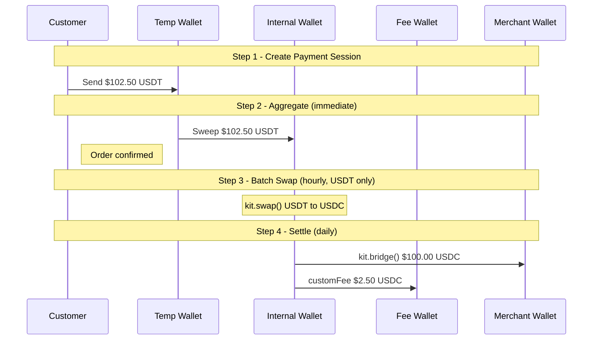

# Stablecoin Acquiring with Aggregation & Batch Processing

## Business Case

Stablecoin acquiring is the process of collecting payments from customers who pay with USDC or USDT across different chains, and settling the equivalent value in USDC to the merchant. A customer might pay with USDT on Ethereum while the merchant receives USDC on Base — with a platform fee deducted automatically. At scale, payments are aggregated into a shared internal wallet, converted to USDC in hourly batches, and settled to merchants daily or on demand.

### Who This Is For

- **Payment Service Providers (PSPs)** — building crypto acquiring infrastructure for merchant networks
- **E-commerce platforms** — adding multi-token crypto checkout to an existing payment stack
- **Fintech companies** — launching a stablecoin payment product with built-in fee monetization

### Key Features

- **Multi-chain payment acceptance** — accept USDC or USDT on any supported chain; App Kit uses built-in token aliases so no contract addresses to manage
- **Temporary wallets per payment** — each order gets a dedicated address, keeping funds isolated until aggregation
- **Batch swaps for cost efficiency** — all tokens of the same type are converted to USDC in a single hourly transaction, saving 80–90% in gas vs per-payment swaps
- **Built-in platform fee collection** — fees are deducted within the same bridge transaction using the `customFee` parameter, no separate transfer needed
- **Direct settlement to external merchant wallets** — `recipientAddress` routes USDC directly to the merchant's wallet on the destination chain; the merchant does not need native tokens to receive it
- **Flexible settlement schedule** — daily, weekly, or on-demand payouts without changing any code

---

## Fund Flow Diagram



### Wallets in This Flow

Five wallet roles appear in this use case. Three are platform-controlled (created and managed by you); two are external.

**Platform-controlled wallets** (you hold the keys via your chosen adapter):

- **Temporary Wallet** — a short-lived wallet created per order. It gives each customer a unique payment address so funds never mix before confirmation. Once the payment is swept to the internal wallet, this wallet is no longer used.
- **Internal Wallet** — a single aggregation wallet that accumulates all incoming payments. Batch swaps and settlement both execute from here. Because everything flows through one wallet, you need only one swap and one bridge per settlement cycle rather than one per order.
- **Fee Wallet** — a platform wallet that receives the 2.5% processing fee. It is set as the `customFee.recipientAddress` on the bridge call, so fee collection happens inside the same transaction as merchant settlement — no separate transfer needed.

**External wallets** (not controlled by your platform):

- **Customer** — the customer's own wallet. They send tokens to the temporary wallet address and never interact with your internal infrastructure directly.
- **Merchant Wallet** — the merchant's external wallet on their preferred chain. Funds are minted directly to this address via CCTP `recipientAddress`; the merchant does not need to hold native tokens to receive USDC.

---

## Choosing Your Adapter

The SDK calls for swap, bridge, and send are identical regardless of adapter. The only differences are key management and what infrastructure you're already on.

| | Ethers (v6) | Circle Wallet |
|---|---|---|
| **Key management** | You hold and store private keys | Circle manages keys — no private key in your code |
| **Best for** | Teams with existing EVM key infrastructure | Enterprises already using Circle Wallets or preferring managed key custody |

---

## Implementation: Ethers Adapter

Use this if your backend holds private keys directly, or if you use an existing EVM wallet infrastructure (Alchemy, Infura, etc.).

### Prerequisites

```bash
npm install @circle-fin/app-kit @circle-fin/adapter-ethers-v6 ethers dotenv
```

```bash
# .env
INTERNAL_WALLET_KEY=0xYourInternalWalletPrivateKey
KIT_KEY=your_kit_key
PLATFORM_FEE_ADDRESS=0xYourFeeWallet
# Optional: bring your own RPC
ALCHEMY_KEY=your_alchemy_key
```

> The ethers adapter requires you to manage private keys. Store them in a secrets manager (AWS Secrets Manager, HashiCorp Vault, etc.) in production — never commit them to source control.

### Step 1: Setup

```typescript
import 'dotenv/config';
import { AppKit } from '@circle-fin/app-kit';
import { createEthersAdapterFromPrivateKey } from '@circle-fin/adapter-ethers-v6';
import { ethers } from 'ethers';

const PLATFORM_FEE_PERCENT = 2.5;  // Deducted from every order at settlement
const SESSION_EXPIRY_MINUTES = 15; // How long a payment address stays active
const SLIPPAGE_BPS = 50;           // Max swap slippage (50 = 0.5%)

const kit = new AppKit();

// Holds all aggregated funds; signs swaps and settlements — load key from secrets manager in production
const internalWalletAdapter = createEthersAdapterFromPrivateKey({
  privateKey: process.env.INTERNAL_WALLET_KEY as string
});

// Derive the on-chain address from the private key — used as the sweep destination
const INTERNAL_WALLET_ADDRESS = new ethers.Wallet(process.env.INTERNAL_WALLET_KEY as string).address;
const PLATFORM_FEE_WALLET = process.env.PLATFORM_FEE_ADDRESS as string;
```

### Step 2: Create Payment Session

With ethers, temporary wallets are generated locally — no API call, no managed service.

```typescript
async function createPaymentSession(orderId: string, orderAmount: string, token: string, chain: string) {
  // Generates a random keypair locally — no network call, no managed service
  const tempWallet = ethers.Wallet.createRandom();
  const amounts = calculateAmounts(orderAmount);

  return {
    sessionId: `session_${orderId}`,
    paymentAddress: tempWallet.address,
    paymentPrivateKey: tempWallet.privateKey, // Stored for use in Step 4 to sign the sweep
    expectedAmount: amounts.total.toFixed(2), // Order amount + platform fee
    expectedToken: token,
    expiresAt: new Date(Date.now() + SESSION_EXPIRY_MINUTES * 60 * 1000)
  };
}
```

### Step 3: Monitor Payment

App Kit uses built-in token aliases (`'USDC'`, `'USDT'`) for `kit.send()`, `kit.swap()`, and `kit.bridge()` — no contract addresses needed there. However, polling for an incoming balance on the temporary wallet requires a direct ERC-20 `balanceOf` read via JSON-RPC, so you do need the contract address at this step.

```typescript
// Contract addresses are only needed here for balance polling — not for kit.send/swap/bridge
const TOKEN_ADDRESSES: Record<string, Record<string, string>> = {
  Ethereum: {
    USDC: '0xa0b86991c6218b36c1d19d4a2e9eb0ce3606eb48',
    USDT: '0xdac17f958d2ee523a2206206994597c13d831ec7',
  },
  Base: {
    USDC: '0x833589fCD6eDb6E08f4c7C32D4f71b54bdA02913',
    USDT: '0xfde4C96c8593536E31F229EA8f37b2ADa2699bb2',
  },
};

// Minimal ABI — we only need balanceOf for read-only balance checks
const ERC20_ABI = ['function balanceOf(address) view returns (uint256)'];

async function monitorPayment(session: any): Promise<boolean> {
  const tokenAddress = TOKEN_ADDRESSES[session.customerChain]?.[session.expectedToken];
  const provider = new ethers.JsonRpcProvider(/* your RPC URL */);
  const contract = new ethers.Contract(tokenAddress, ERC20_ABI, provider);
  const expectedRaw = ethers.parseUnits(session.expectedAmount, 6); // USDC/USDT both use 6 decimals

  // Poll every 5 seconds, up to 5 minutes
  for (let attempt = 0; attempt < 60; attempt++) {
    const balance: bigint = await contract.balanceOf(session.paymentAddress);
    if (balance >= expectedRaw) return true;
    await new Promise(resolve => setTimeout(resolve, 5000));
  }
  return false; // Timed out — cancel or retry the order
}
```

### Step 4: Aggregate to Internal Wallet

Use the private key stored in the session to create an adapter for the temporary wallet.

```typescript
async function aggregateToInternalWallet(session: any) {
  // Reconstruct an adapter for the temp wallet so kit.send() can sign the sweep
  const tempPaymentAdapter = createEthersAdapterFromPrivateKey({
    privateKey: session.paymentPrivateKey
  });

  // Sweeps all funds from the temp wallet — after this it's empty and retired
  const result = await kit.send({
    from: { adapter: tempPaymentAdapter, chain: session.customerChain },
    to: INTERNAL_WALLET_ADDRESS,
    amount: session.expectedAmount,
    token: session.expectedToken
  });

  return result.txHash;
}
```

### Step 5: Batch Swap + Settlement

The swap and settlement calls are identical to the Circle Wallet version — only the adapter variable changes.

```typescript
// Hourly job — swaps all accumulated tokens of one type to USDC in a single tx
// (1 tx per token type instead of 1 per payment = 80-90% gas savings)
async function batchSwapToUSDC(chain: string, token: string, totalAmount: number) {
  if (token === 'USDC') return 'no-swap'; // Already in target currency — skip

  const result = await kit.swap({
    from: { adapter: internalWalletAdapter, chain },
    tokenIn: token,
    tokenOut: 'USDC',
    amountIn: totalAmount.toFixed(2),
    config: { kitKey: process.env.KIT_KEY as string, slippageBps: SLIPPAGE_BPS }
  });

  return result.txHash;
}

// Daily or on-demand — bridges USDC to the merchant and collects the platform fee in one tx
async function settleMerchant(merchantAddress: string, merchantChain: string, amount: number, fee: number) {
  const bridgeResult = await kit.bridge({
    from: { adapter: internalWalletAdapter, chain: 'Ethereum' },
    to: {
      adapter: internalWalletAdapter,
      chain: merchantChain,
      // Mints USDC directly to the merchant's external wallet on the destination chain
      recipientAddress: merchantAddress
    },
    amount: amount.toFixed(2),
    config: {
      transferSpeed: 'SLOW', // Free — no CCTP protocol fee
      // Deducts the platform fee inside the same bridge tx — no separate transfer needed
      // Circle takes 10% of this; your platform receives 90%
      customFee: { value: fee.toFixed(2), recipientAddress: PLATFORM_FEE_WALLET }
    }
  });

  return bridgeResult.steps.map(s => s.txHash);
}
```

---

## Implementation: Circle Wallet Adapter

Use this if you manage wallets through Circle's developer-controlled wallet service. Circle handles key custody — you interact via API key and entity secret.

### Prerequisites

```bash
npm install @circle-fin/app-kit @circle-fin/adapter-circle-wallets @circle-fin/developer-controlled-wallets dotenv
```

```bash
# .env
CIRCLE_API_KEY=your_circle_api_key
CIRCLE_ENTITY_SECRET=your_entity_secret
INTERNAL_WALLET_ID=your_internal_wallet_id
INTERNAL_WALLET_ADDRESS=0xYourInternalWalletAddress
WALLET_SET_ID=your_wallet_set_id
KIT_KEY=your_kit_key
PLATFORM_FEE_ADDRESS=0xYourFeeWallet
```

> Get your Circle credentials at [console.circle.com](https://console.circle.com/). See the [Circle Wallet Quickstart](https://developers.circle.com/w3s/docs/programmable-wallets-quickstart) for wallet setup.

### Step 1: Setup

```typescript
import 'dotenv/config';
import { AppKit } from '@circle-fin/app-kit';
import { createCircleWalletsAdapter } from '@circle-fin/adapter-circle-wallets';

const PLATFORM_FEE_PERCENT = 2.5;  // Deducted from every order at settlement
const SESSION_EXPIRY_MINUTES = 15; // How long a payment address stays active
const SLIPPAGE_BPS = 50;           // Max swap slippage (50 = 0.5%)

const kit = new AppKit();

// One adapter instance covers all Circle wallets — wallet is identified by address per call
const circleAdapter = createCircleWalletsAdapter({
  apiKey: process.env.CIRCLE_API_KEY as string,
  entitySecret: process.env.CIRCLE_ENTITY_SECRET as string,
});

const INTERNAL_WALLET_ADDRESS = process.env.INTERNAL_WALLET_ADDRESS as string;
const WALLET_SET_ID = process.env.WALLET_SET_ID as string; // Groups wallets under your Circle account
const PLATFORM_FEE_WALLET = process.env.PLATFORM_FEE_ADDRESS as string;
```

### Step 2: Create Payment Session

Create a managed wallet via the Circle SDK, accessed through `circleAdapter.getSdk()`.

```typescript
async function createPaymentSession(orderId: string, orderAmount: string, token: string, chain: string) {
  const sdk = await circleAdapter.getSdk();

  // Circle holds the keys — no private key to manage on your side
  const walletResponse = await sdk.devc.createWallets({
    idempotencyKey: `payment-${orderId}`, // Prevents duplicate wallets on retries
    walletSetId: WALLET_SET_ID,
    blockchains: [chain as any],  // e.g. 'ETH', 'BASE', 'MATIC', 'ARB'
    count: 1,
    metadata: [{ name: `Payment-${orderId}`, refId: orderId }],
  });

  const wallet = walletResponse.data?.wallets?.[0];
  if (!wallet?.id || !wallet?.address) throw new Error('Failed to create wallet');

  const amounts = calculateAmounts(orderAmount);

  return {
    sessionId: `session_${orderId}`,
    paymentAddress: wallet.address,
    paymentWalletId: wallet.id,    // Used for balance polling and the sweep in Step 4
    expectedAmount: amounts.total.toFixed(2), // Order amount + platform fee
    expectedToken: token,
    customerChain: chain,
    expiresAt: new Date(Date.now() + SESSION_EXPIRY_MINUTES * 60 * 1000)
  };
}
```

### Step 3: Monitor Payment

Poll the Circle Wallet API via `getWalletTokenBalance` — no RPC node or contract ABI needed.

```typescript
async function monitorPayment(session: any): Promise<boolean> {
  const sdk = await circleAdapter.getSdk();

  // Poll every 5 seconds, up to 5 minutes
  for (let attempt = 0; attempt < 60; attempt++) {
    // Circle API returns balance directly — no on-chain read or contract ABI needed
    const balanceResponse = await sdk.devc.getWalletTokenBalance({ id: session.paymentWalletId });
    const balances = balanceResponse.data?.tokenBalances ?? [];
    const tokenBalance = balances.find(
      (b: any) => b.token?.symbol?.toUpperCase() === session.expectedToken.toUpperCase()
    );

    if (parseFloat(tokenBalance?.amount ?? '0') >= parseFloat(session.expectedAmount)) {
      return true;
    }

    await new Promise(resolve => setTimeout(resolve, 5000));
  }
  return false; // Timed out — cancel or retry the order
}
```

### Step 4: Aggregate to Internal Wallet

The Circle Wallets adapter requires an explicit `address` in the `from` context — one adapter instance covers all wallets.

```typescript
async function aggregateToInternalWallet(session: any) {
  const result = await kit.send({
    from: {
      adapter: circleAdapter,
      chain: session.customerChain as any,
      address: session.paymentAddress, // Required — identifies which Circle wallet to send from
    },
    to: INTERNAL_WALLET_ADDRESS,
    amount: session.expectedAmount,
    token: session.expectedToken as any,
  });

  return result.txHash ?? '';
}
```

### Step 5: Batch Swap + Settlement

The `address` field is required in `from` for Circle Wallets. The swap and bridge logic is otherwise identical to the ethers adapter.

```typescript
// Hourly job — swaps all accumulated tokens of one type to USDC in a single tx
// (1 tx per token type instead of 1 per payment = 80-90% gas savings)
async function batchSwapToUSDC(chain: string, token: string, totalAmount: number) {
  if (token === 'USDC') return 'no-swap'; // Already in target currency — skip

  const result = await kit.swap({
    from: { adapter: circleAdapter, chain: chain as any, address: INTERNAL_WALLET_ADDRESS }, // address required for Circle Wallets
    tokenIn: token as any,
    tokenOut: 'USDC',
    amountIn: totalAmount.toFixed(2),
    config: { kitKey: process.env.KIT_KEY as string, slippageBps: SLIPPAGE_BPS }
  });

  return result.txHash;
}

// Daily or on-demand — bridges USDC to the merchant and collects the platform fee in one tx
async function settleMerchant(merchantAddress: string, merchantChain: string, amount: number, fee: number) {
  const bridgeResult = await kit.bridge({
    from: { adapter: circleAdapter, chain: 'Ethereum' as any, address: INTERNAL_WALLET_ADDRESS }, // address required for Circle Wallets
    to: {
      adapter: circleAdapter,
      chain: merchantChain as any,
      address: merchantAddress,
      // Mints USDC directly to the merchant's external wallet on the destination chain
      recipientAddress: merchantAddress,
    },
    amount: amount.toFixed(2),
    config: {
      transferSpeed: 'SLOW', // Free — no CCTP protocol fee
      // Deducts the platform fee inside the same bridge tx — no separate transfer needed
      // Circle takes 10% of this; your platform receives 90%
      customFee: { value: fee.toFixed(2), recipientAddress: PLATFORM_FEE_WALLET }
    }
  });

  return bridgeResult.steps.map(s => s.txHash ?? '');
}
```

---

## Adapter Differences at a Glance

| Step | Ethers | Circle Wallets |
|---|---|---|
| **Init adapter** | `createEthersAdapterFromPrivateKey({ privateKey })` | `createCircleWalletsAdapter({ apiKey, entitySecret })` |
| **Create temp wallet** | `ethers.Wallet.createRandom()` — local, no API call | `sdk.devc.createWallets({ blockchains, walletSetId, ... })` — Circle API |
| **Check balance** | Read ERC-20 contract via JSON-RPC provider | `sdk.devc.getWalletTokenBalance({ id: walletId })` — Circle API |
| **from context** | `{ adapter, chain }` | `{ adapter, chain, address }` — address required |
| **Swap / Bridge / Send** | Identical | Identical |

---

## Resources

- [Circle App Kit Documentation](https://developers.circle.com/app-kit)
- [Adapter Setups](https://developers.circle.com/app-kit/adapter-setups)
- [Circle Wallet Quickstart](https://developers.circle.com/w3s/docs/programmable-wallets-quickstart)
- [Full Circle Wallet Example](./01-stablecoin-acquiring.ts)
